

<a href="README.md">English</a> · <a href="README.es.md">Español</a>

<a href="https://www.linkedin.com/in/bhbenitez/">LinkedIn</a> · <a href="mailto:berniebeniteza@gmail.com">Email</a> · <a href="CAREER.es.md">Trayectoria completa</a> · <a href="https://www.credly.com/badges/6b337c94-aaa3-4324-8088-55798c31cacf?source=linked_in_profile">Certificación</a>

Diseño e implemento automatización empresarial, desde el levantamiento y la arquitectura hasta el despliegue y soporte. Mi trabajo combina Microsoft Power Platform, Copilot Studio, RPA, APIs en Python e IA generativa en AWS.

**Actualmente en EVOL** · AI & Intelligent Automation Architect, desde agosto de 2026.

  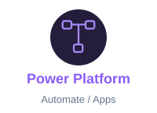
  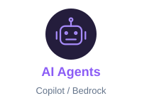
  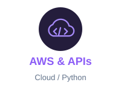
  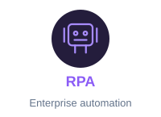
  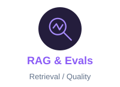

## 🚀 Proyectos de IA y automatización

  <a href="https://github.com/berniehans/AxiomRAG">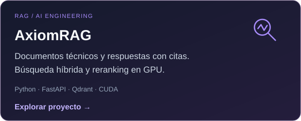</a>
  <a href="https://github.com/berniehans/OmniModel_Auditor">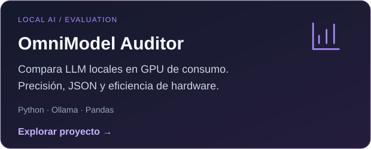</a>

  <a href="https://github.com/berniehans/OmniSearch_Mesh">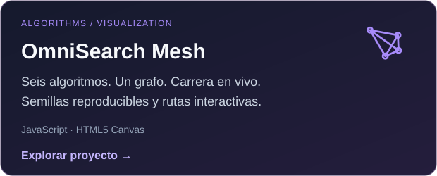</a>
  <a href="https://github.com/berniehans/rust-fundamentals">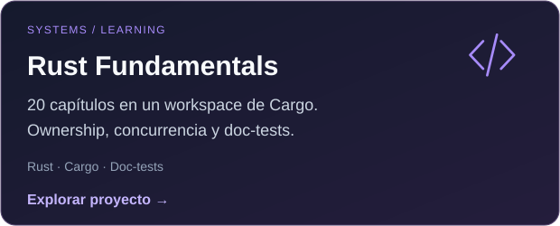</a>

**Más proyectos:** [LazyArcade](https://github.com/berniehans/lazyarcade) · [NASA Space Apps tools](https://github.com/berniehans/NSAC_SCRAPER)

🎬 Demos, gráficos y arquitectura de los proyectos

### AxiomRAG

<a href="https://github.com/berniehans/AxiomRAG">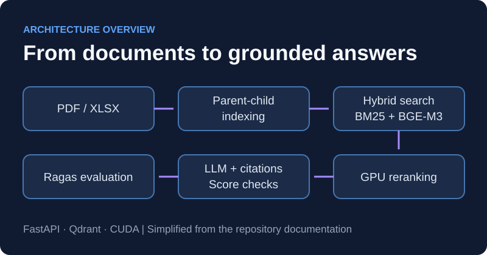</a>

### OmniModel Auditor

### OmniSearch Mesh

## 🧭 Trayectoria profesional

| Empresa y cargo | Periodo |
|---|---|
| **EVOL** · AI & Intelligent Automation Architect | 2026-08 – Actualidad |
| **Seventec** · AI & RPA Solutions Architect | 2023-11 – 2025-05 |

Anteriormente: Gesnext · Belltech · NTT Data · Indra · Equifax.  
[**Trayectoria completa →**](CAREER.es.md)

## 🎓 Formación y logros

- **NASA Space Apps Challenge 2025:** Ganador nacional.
- **Hackathon Internacional de Indra:** Ganador.
- **Maestría en IA · UNI, 2024–2025:** Cursos completados; **tesis pendiente**. Promedio de cursos: 17/20.
- **Ingeniería en Informática y Sistemas · USIL:** Grado obtenido en 2017.
- [**Blue Prism Certified Developer ↗**](https://www.credly.com/badges/6b337c94-aaa3-4324-8088-55798c31cacf?source=linked_in_profile)

🛠️ Competencias técnicas e idiomas

- **Microsoft Power Platform & RPA:** Power Automate Cloud/Desktop, Power Apps, Copilot Studio, SharePoint Lists, Actions/Tools, webhooks, Blue Prism, Automation Anywhere A360, Robocorp, Selenium, Playwright.
- **APIs, Data & BI:** Python, FastAPI, Flask, REST, Bearer Tokens, API Keys, SQL, Bulk Insert, stored procedures, Power BI, Power Query, DAX, dimensional ETL.
- **AWS, AI & Evals:** Bedrock, SageMaker, Lambda, S3, API Gateway, IAM, CloudWatch, Textract, Docker, LLMs, RAG, Golden Datasets, Ragas, Qdrant, prompt engineering.
- **Languages:** Java, C#, VBA.

Español: nativo · Inglés: avanzado

---

<strong>Construyamos automatización útil.</strong> <a href="https://www.linkedin.com/in/bhbenitez/">LinkedIn</a> · <a href="mailto:berniebeniteza@gmail.com">Email</a> · <a href="https://orcid.org/0009-0002-9572-8688">ORCID</a>

