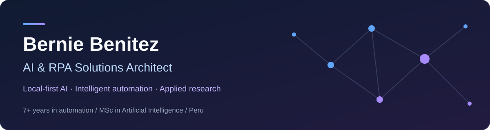
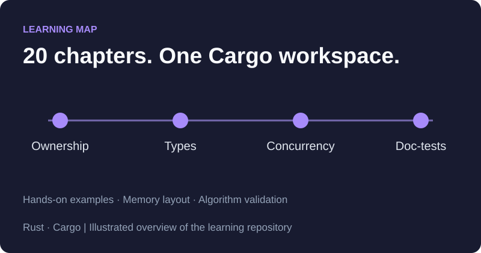

  <strong>English</strong> · <a href="README.es.md">Español</a> 
  <a href="https://www.linkedin.com/in/bhbenitez/">LinkedIn</a> · <a href="mailto:berniebeniteza@gmail.com">Email</a> · <a href="https://orcid.org/0009-0002-9572-8688">ORCID</a>

I'm a **Computer & Systems Engineer** with **7+ years in RPA and AI**, working across the full automation lifecycle at Indra, NTT Data, Belltech and Seventec. I build around **local-first AI, autonomous agents and practical automation**.

**Open to work:** AI Solutions Architect · RPA Architect · Senior AI Engineer  
Peru · Remote · Hybrid · Onsite

## Selected projects

<table>
  <tr>
    <td width="50%" valign="top">
      
      <h3>AxiomRAG</h3>
      
Retrieve context from technical documents and generate answers with citations. Hybrid search, parent-child retrieval and GPU reranking.

      
Python · FastAPI · Qdrant · CUDA

      
<a href="https://github.com/berniehans/AxiomRAG"><strong>Architecture & code →</strong></a>

    </td>
    <td width="50%" valign="top">
      
      <h3>OmniModel Auditor</h3>
      
Compare local LLMs on consumer hardware: accuracy, JSON compliance, latency and GPU usage.

      
Python · Ollama · Pandas · Matplotlib

      
<a href="https://github.com/berniehans/OmniModel_Auditor"><strong>Benchmark reports & code →</strong></a>

    </td>
  </tr>
  <tr>
    <td width="50%" valign="top">
      
      <h3>OmniSearch Mesh</h3>
      
Watch six search algorithms compete on the same graph, with reproducible seeds and draggable endpoints.

      
JavaScript · HTML5 Canvas · CSS

      
<a href="https://github.com/berniehans/OmniSearch_Mesh"><strong>Animation & code →</strong></a>

    </td>
    <td width="50%" valign="top">
      
      <h3>rust-fundamentals</h3>
      
Explore 20 chapters of idiomatic Rust, from ownership and memory layout to concurrency and algorithm validation.

      
Rust · Cargo · Doc-tests

      
<a href="https://github.com/berniehans/rust-fundamentals"><strong>Examples & code →</strong></a>

    </td>
  </tr>
</table>

**More to explore:** [LazyArcade — six retro games in a Rust terminal app](https://github.com/berniehans/lazyarcade) · [NASA Space Apps scraping tools](https://github.com/berniehans/NSAC_SCRAPER)

## Research & milestones

- **NASA Space Apps Challenge 2025:** National Winner & Global Finalist.
- **Indra Hackathon:** Winner in Brazil.
- **MSc in Artificial Intelligence — UNI, 2025:** 17/20. Thesis on facial expression recognition under synthetic degradation using ResNet-18.
- **BSc in Computer & Systems Engineering — USIL, 2017.**

## Core technologies

More technologies & practices

- **AI & evaluation:** LangChain, TensorFlow, Scikit-learn, Ragas.
- **Automation:** Automation Anywhere, Selenium, Playwright.
- **Cloud & infrastructure:** AWS SageMaker, AWS Bedrock, CUDA.
- **Languages & delivery:** Java, C#, Git, Jira, Scrum.

---

**Let's build useful automation.**  
[Connect on LinkedIn](https://www.linkedin.com/in/bhbenitez/) · [Email me](mailto:berniebeniteza@gmail.com) · [Research profile](https://orcid.org/0009-0002-9572-8688)
