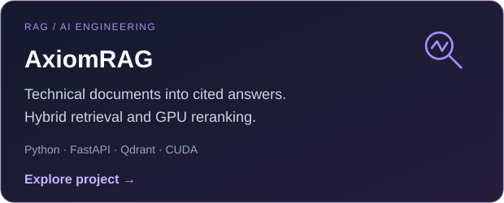
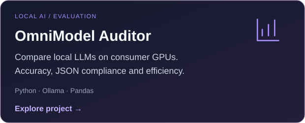
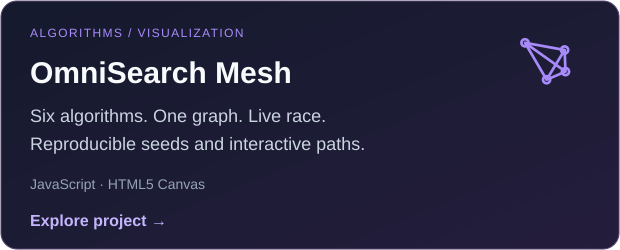
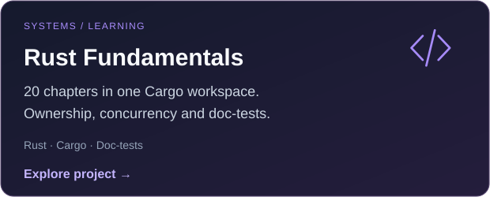

<a href="README.md">English</a> · <a href="README.es.md">Español</a>

<a href="https://www.linkedin.com/in/bhbenitez/">LinkedIn</a> · <a href="mailto:berniebeniteza@gmail.com">Email</a> · <a href="CAREER.md">Full background</a> · <a href="https://www.credly.com/badges/6b337c94-aaa3-4324-8088-55798c31cacf?source=linked_in_profile">Certification</a>

I design and deliver enterprise automation, from process discovery and architecture to deployment and support. My work combines Microsoft Power Platform, Copilot Studio, RPA, Python APIs and generative AI on AWS.

**Currently at EVOL** · AI & Intelligent Automation Architect · 2026-08 – Present.

  
  
  
  
  

## 🚀 AI & automation projects

  
  

  
  

**Also building:** [LazyArcade](https://github.com/berniehans/lazyarcade) · [NASA Space Apps tools](https://github.com/berniehans/NSAC_SCRAPER)

🎬 Project demos, charts & architecture

### AxiomRAG

### OmniModel Auditor

### OmniSearch Mesh

## 🧭 Professional background

| Company & role | Period |
|---|---|
| **EVOL** · AI & Intelligent Automation Architect | 2026-08 – Present |
| **Seventec** · AI & RPA Solutions Architect | 2023-11 – 2025-05 |

Earlier: Gesnext · Belltech · NTT Data · Indra · Equifax.  
[**Full background →**](CAREER.md)

## 🎓 Education & milestones

- National winner of NASA Space Apps Challenge 2025. Developed a Python REST API as the backend for an Amazon Bedrock agent with a knowledge base for a web application.
- Winner of the International Indra Hackathon.
- **Master's program in Artificial Intelligence · Universidad Nacional de Ingeniería (UNI) · 2024-2025:** Coursework completed; thesis pending. Coursework average: 17/20.
- **Computer and Systems Engineering · Universidad San Ignacio de Loyola (USIL) · 2017:** Graduated; degree obtained in 2017.
- [**Blue Prism Certified Developer ↗**](https://www.credly.com/badges/6b337c94-aaa3-4324-8088-55798c31cacf?source=linked_in_profile)

🛠️ Technical competencies & languages

- **Microsoft Power Platform & RPA:** Power Automate Cloud/Desktop, Power Apps, Copilot Studio, SharePoint Lists, Actions/Tools, webhooks, Blue Prism, Automation Anywhere A360, Robocorp, Selenium, Playwright.
- **APIs, Data & BI:** Python, FastAPI, Flask, REST, Bearer Tokens, API Keys, SQL, Bulk Insert, stored procedures, Power BI, Power Query, DAX, dimensional ETL.
- **AWS, AI & Evals:** Bedrock, SageMaker, Lambda, S3, API Gateway, IAM, CloudWatch, Textract, Docker, LLMs, RAG, Golden Datasets, Ragas, Qdrant, prompt engineering.
- **Languages:** Java, C#, VBA.

Spanish: native · English: advanced

---

<strong>Let's build useful automation.</strong> <a href="https://www.linkedin.com/in/bhbenitez/">LinkedIn</a> · <a href="mailto:berniebeniteza@gmail.com">Email</a> · <a href="https://orcid.org/0009-0002-9572-8688">ORCID</a>

